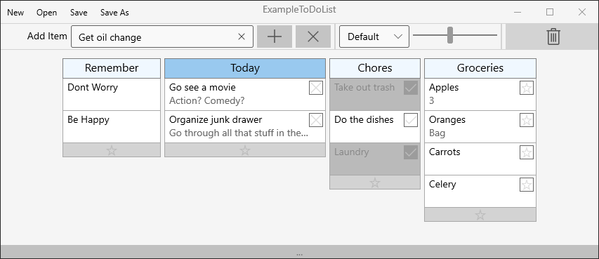
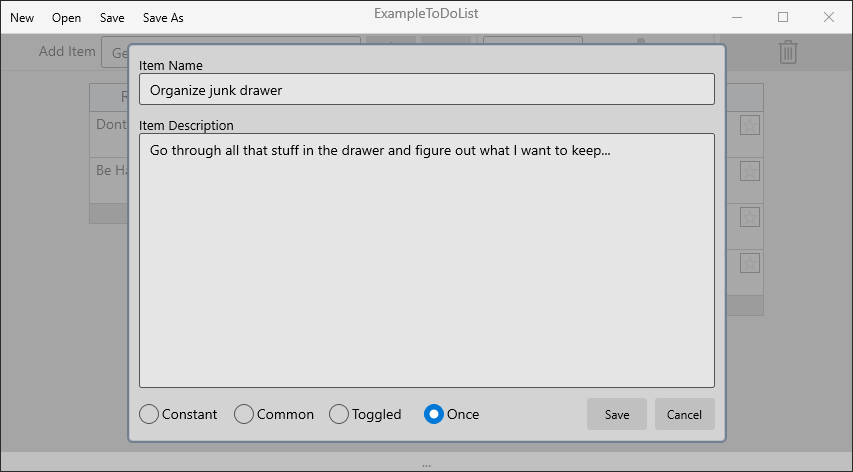

# ToDoApp
A to-do list / productivity tool I created as an easy way to organize items into categories with the ability to reorder by drag and drop. I chose to make this in UWP just to broaden my knowledge.

There are four types of items that can be added to a category:

-Constant: Has no symbol on the right side and can only be deleted by dragging them into the trash can. 

-Common: Has a star symbol on the right side. Clicking the star will remove the item from the main list  and move it to the Common list which is accessed by clicking the Category’s footer with the star on it. Double clicking the item in the Common list will return it to the main list.

-Toggled: Has a check box symbol on the right side. Clicking the check box will toggle the item to be greyed out, but not removed from the list.

-Once: Has an X symbol on the right side. Clicking the X will delete the item. Accidentally deleted items can be retrieved from the trash by double clicking the trash can icon, however the trash is emptied when the program is exited.
